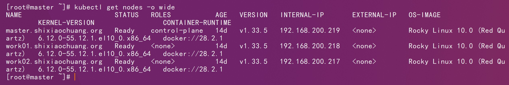
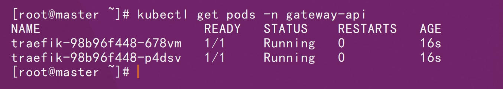

# 一、基础环境



# 二、部署

```sh
kubectl create namespace gateway-api
```

```sh
kubectl apply --server-side -f standard-install.yaml
```

```sh
kubectl apply -f kubernetes-crd-rbac.yml
```

```sh
kubectl apply -f traefik-config.yaml
```

```sh
kubectl apply -f traefik-deploy.yaml
```

```sh
kubectl get pods -n gateway-api
```



```sh
kubectl apply -f traefik-service.yaml
```

```sh
kubectl apply -f traefik-gatewayClass.yaml
```

```sh
kubectl apply -f traefik-gateway.yaml
```

```sh
kubectl get gateway -n gateway-api
```


```sh
kubectl apply -f traefik-dashboard.yaml
```


