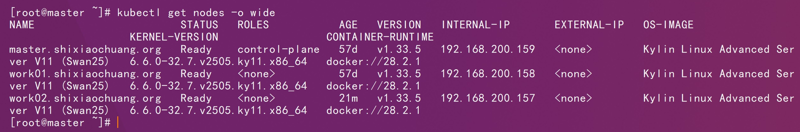
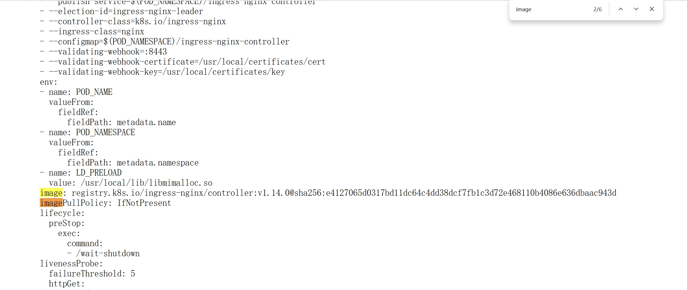
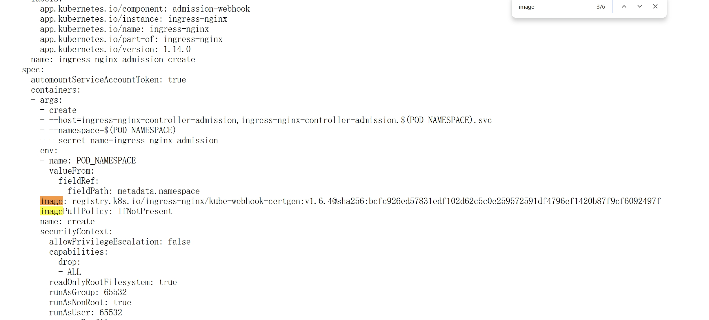
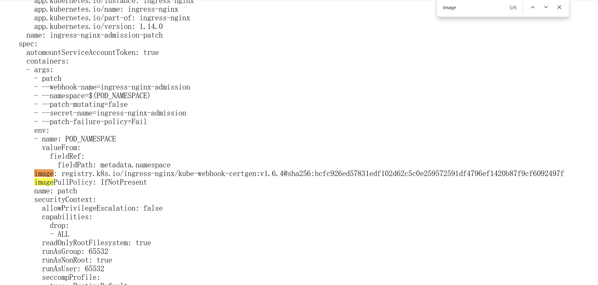
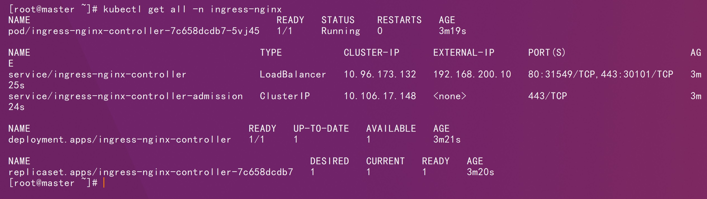
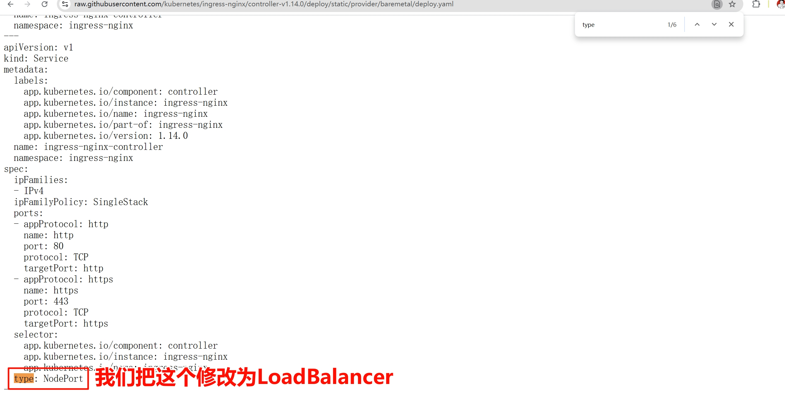
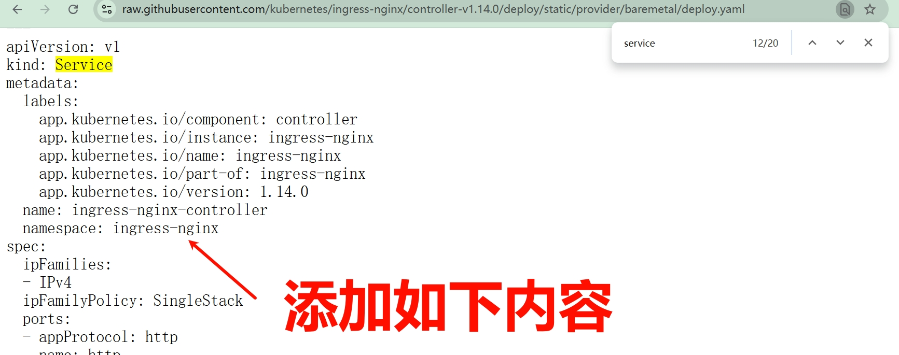
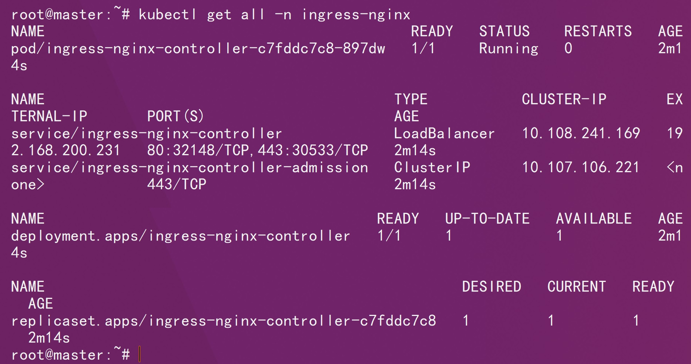

# 一、基础环境



# 二、官方仓库

```http
https://raw.githubusercontent.com/kubernetes/ingress-nginx/controller-v1.14.0/deploy/static/provider/baremetal/deploy.yaml
```

# 三、镜像修改








```sh
docker pull registry.k8s.io/ingress-nginx/controller:v1.14.0
```

```sh
docker pull registry.k8s.io/ingress-nginx/kube-webhook-certgen:v1.6.4
```

```sh
docker tag registry.k8s.io/ingress-nginx/controller:v1.14.0 shixiaochuangk8s/ingress-nginx-controller:v1.14.0
```

```sh
docker tag registry.k8s.io/ingress-nginx/kube-webhook-certgen:v1.6.4 shixiaochuangk8s/ingress-nginx-kube-webhook-certgen:v1.6.4
```

```sh
docker push shixiaochuangk8s/ingress-nginx-controller:v1.14.0
```

```sh
docker push shixiaochuangk8s/ingress-nginx-kube-webhook-certgen:v1.6.4
```

# 四、部署

外部的负载均衡器为metallb：


```sh
kubectl apply -f deploy-metallb.yaml
```

```sh
kubectl get pods -n ingress-nginx
```



外部的负载均衡器为openelb：





```yaml
annotations:
    lb.kubesphere.io/v1alpha1: openelb
    protocol.openelb.kubesphere.io/v1alpha1: layer2
    eip.openelb.kubesphere.io/v1alpha2: eip-pool
```

```sh
kubectl apply -f deploy-openelb.yaml
```

