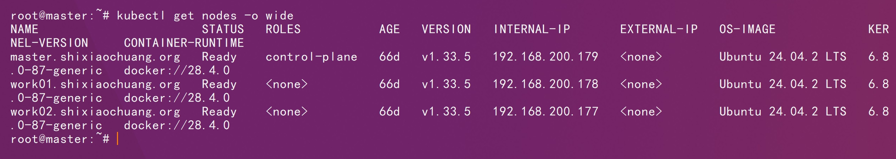
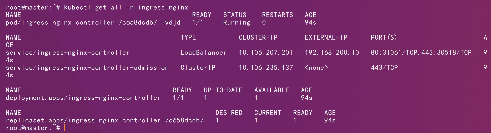
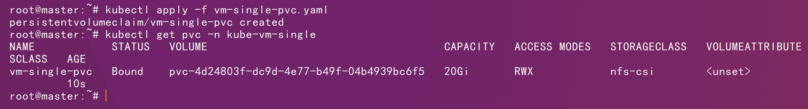
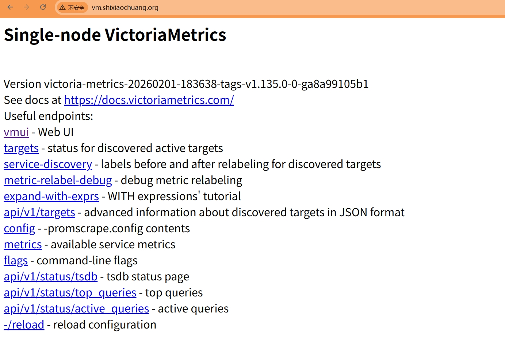
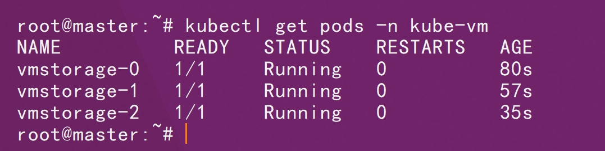
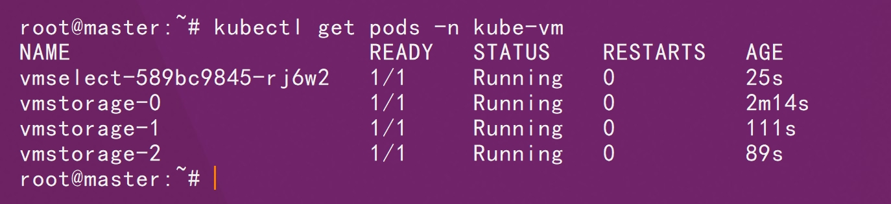
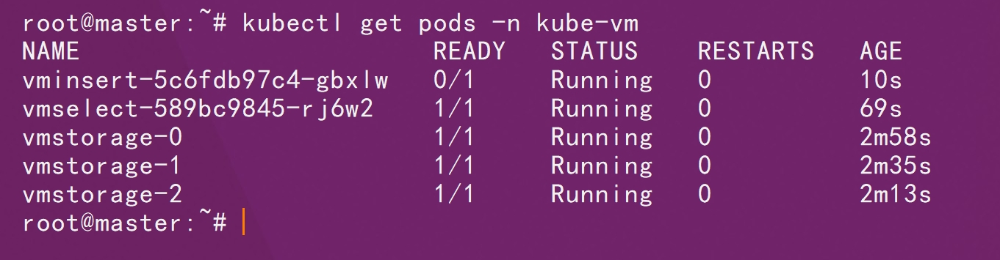
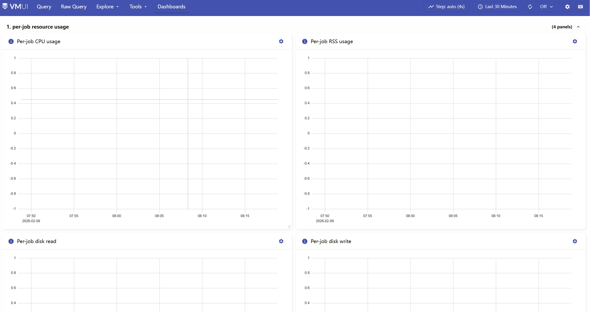

# 一、基础环境说明



# 二、镜像修改

## victoria-metrics

```sh
docker pull victoriametrics/victoria-metrics:v1.135.0
```

```sh
docker tag victoriametrics/victoria-metrics:v1.135.0 shixiaochuangk8s/victoria-metrics:v1.135.0
```

```sh
docker push shixiaochuangk8s/victoria-metrics:v1.135.0
```

## vmstorage

```sh
docker pull victoriametrics/vmstorage:v1.135.0-cluster
```

```sh
docker tag victoriametrics/vmstorage:v1.135.0-cluster shixiaochuangk8s/vmstorage:v1.135.0-cluster
```

```sh
docker push shixiaochuangk8s/vmstorage:v1.135.0-cluster
```

## vmselect

```sh
docker pull victoriametrics/vmselect:v1.135.0-cluster
```

```sh
docker tag victoriametrics/vmselect:v1.135.0-cluster shixiaochuangk8s/vmselect:v1.135.0-cluster
```

```sh
docker push shixiaochuangk8s/vmselect:v1.135.0-cluster
```

## vminsert

```sh
docker pull victoriametrics/vminsert:v1.135.0-cluster
```

```sh
docker tag victoriametrics/vminsert:v1.135.0-cluster shixiaochuangk8s/vminsert:v1.135.0-cluster
```

```sh
docker push shixiaochuangk8s/vminsert:v1.135.0-cluster
```

# 三、部署

## 3.1、前提环境

### 3.1.1、nfs-csi部署

部署参考：

```http
https://github.com/shixiaochuangdev/k8s-deploy/tree/main/csi-driver-nfs/v4-12-1
```

### 3.1.2、部署ingress nginx controller

部署参考：

```http
https://github.com/shixiaochuangdev/k8s-deploy/tree/main/IngressNginxController/v1-14-0
```



## 3.2、单机

```sh
kubectl create ns kube-vm-single
```

```sh
kubectl apply -f vm-single-pvc.yaml
```



```sh
kubectl apply -f victoria-metrics-single.yaml
```

```sh
kubectl get pods -n kube-vm-single
```


```sh
kubectl apply -f victoria-metrics-svc.yaml
```

```sh
kubectl apply -f victoria-metrics-ingree-single.yaml
```

```http
http://vm.shixiaochuang.org/
```



集成prometheus

```yaml
 remote_write:
      - url: "http://victoria-metrics.kube-vm-single.svc.cluster.local:8428/api/v1/write"
        queue_config:
          max_samples_per_send: 10000
          max_shards: 10
          capacity: 20000
```

集成grafana

```sh
 "url": "http://victoria-metrics.kube-vm-single.svc.cluster.local:8428"
```

## 3.3、集群版

```sh
kubectl create namespace kube-vm
```

```sh
kubectl apply -f cluster-vmstorage.yaml
```

```sh
kubectl get pods -n kube-vm
```



```sh
kubectl apply -f cluster-vmselect.yaml
```



```sh
kubectl apply -f cluster-vminsert.yaml
```



```sh
kubectl apply -f cluster-ingress.yaml
```

```http
http://vm.shixiaochuang.org/select/0/
```



集成Prometheus:

```yaml
 remote_write:
      - url: "http://vminsert.kube-vm.svc.cluster.local:8480/insert/0/prometheus/api/v1/write"
        queue_config:
          max_samples_per_send: 10000
          max_shards: 10
          capacity: 20000
```

集成grafana:

```yaml
"url": "http://vmselect.kube-vm.svc.cluster.local:8481/select/0",
```

