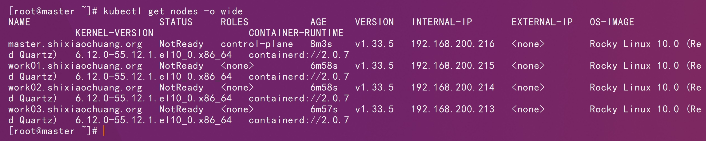
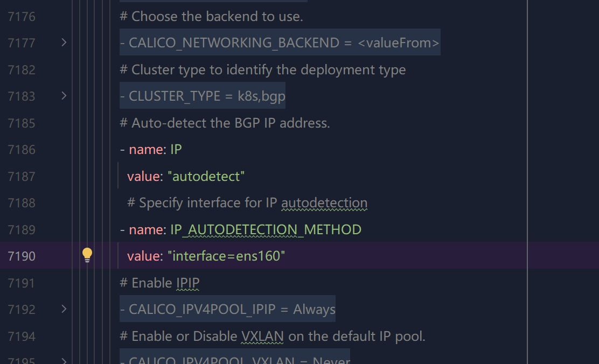
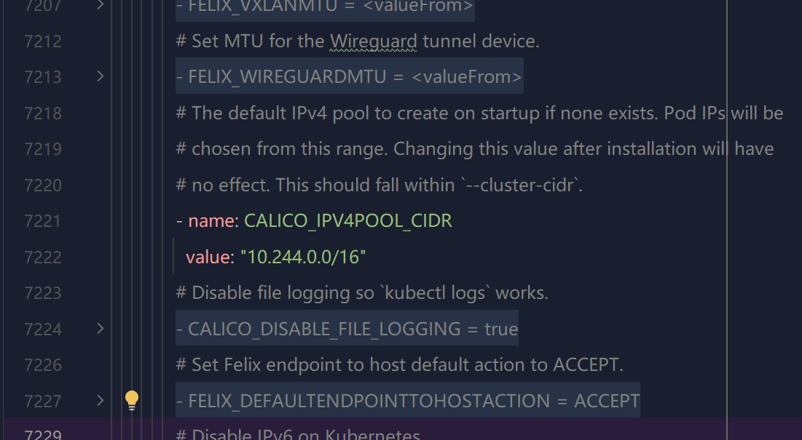

# 一、基础环境



# 二、镜像修改

```http
https://raw.githubusercontent.com/projectcalico/calico/refs/tags/v3.31.2/manifests/calico.yaml
```


```sh
dockewr pull quay.io/calico/cni:v3.31.2
```


```sh
docker pull quay.io/tigera/operator:v1.40.2
```

```sh
docker tag quay.io/tigera/operator:v1.40.2 shixiaochuangk8s/tigera-operator:v1.40.2 
```

```sh
docker push shixiaochuangk8s/tigera-operator:v1.40.2 
```

# 三、部署

从 **Calico v3.20+ 开始**，官方推荐使用 **Tigera Operator（Operator 模式）** 来管理 Calico，而不是直接应用 `calico.yaml`。

- tigera-operator.yaml：部署 Tigera Operator 控制器（一个自定义控制器），它会：
  - 监听 `Installation`、`APIServer` 等自定义资源（CRD）
  - 自动创建和管理 Calico 所需的 DaemonSet、Deployment、ConfigMap、RBAC 等
- `custom-resources.yaml`：定义 **Calico 的配置声明**（如网络 CIDR、IPAM、是否启用 BGP 等），由 Operator 读取并生效

```sh
kubectl apply -f tigera-operator.yaml
```

```sh
kubectl get pods -n tigera-operator
```


```sh
kubectl apply -f custom-resources.yaml
```

```sh
kubectl get pods -n calico-system 
```


```yaml
            # Auto-detect the BGP IP address.
            - name: IP
              value: "autodetect"
            # Specify interface for IP autodetection
            - name: IP_AUTODETECTION_METHOD
              value: "interface=ens33"
            # Enable IPIP
            - name: CALICO_IPV4POOL_IPIP
              value: "Always"
```




```yaml
            # The default IPv4 pool to create on startup if none exists.
            - name: CALICO_IPV4POOL_CIDR
              value: "10.244.0.0/16"
```


