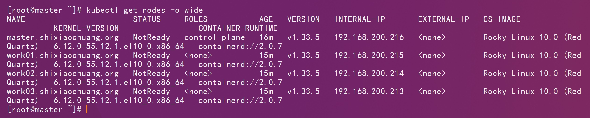
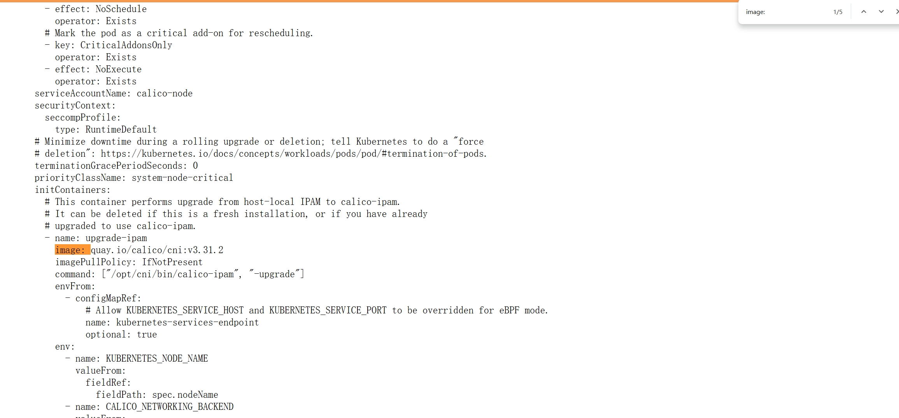
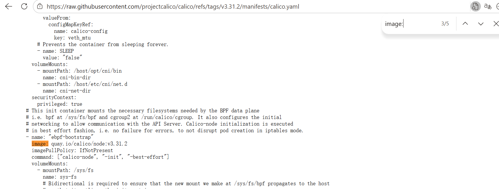
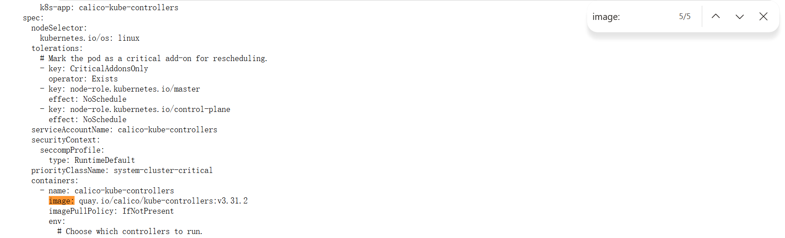
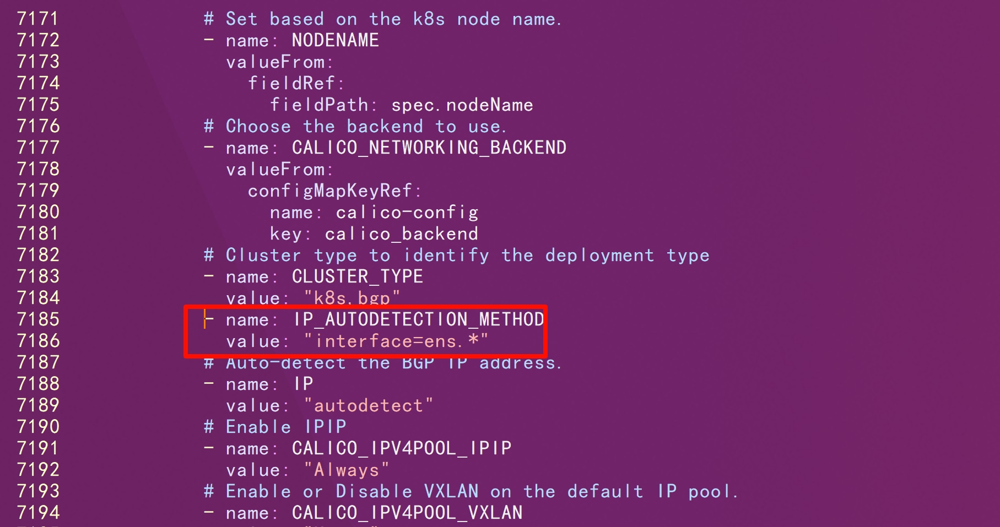
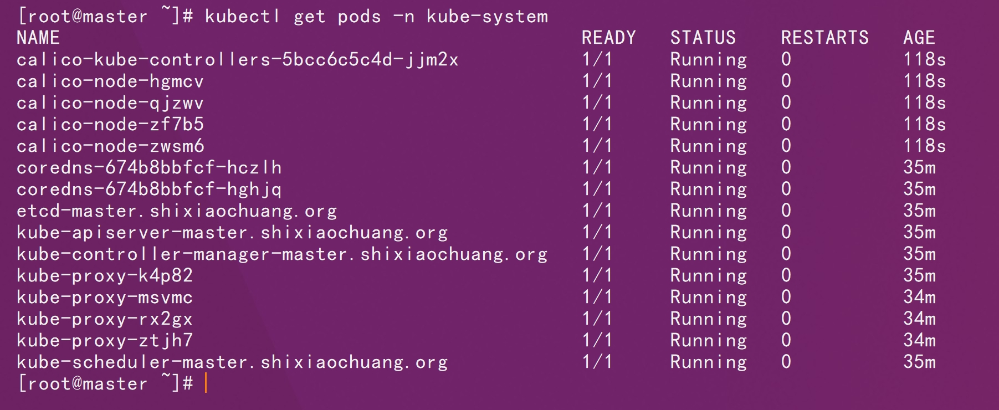
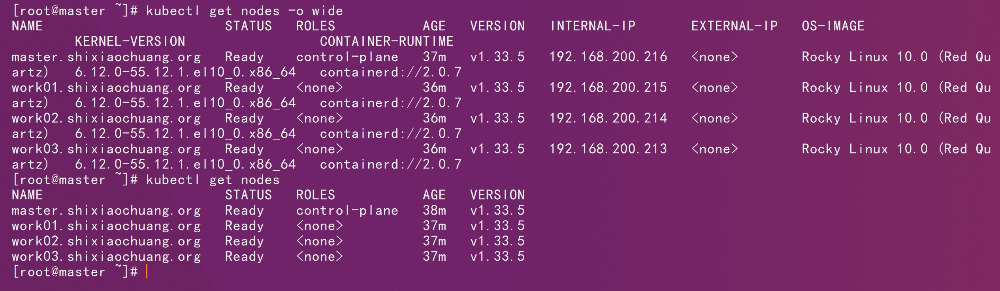

# 一、基础环境



# 二、镜像修改

```http
https://raw.githubusercontent.com/projectcalico/calico/refs/tags/v3.31.2/manifests/calico.yaml
```







```sh
docker pull quay.io/calico/cni:v3.31.2
```

```sh
docker tag quay.io/calico/cni:v3.31.2 shixiaochuangk8s/calico-cni:v3.31.2
```

```sh
docker push shixiaochuangk8s/calico-cni:v3.31.2
```

```sh
docker pull quay.io/calico/node:v3.31.2
```

```sh
docker tag quay.io/calico/node:v3.31.2 shixiaochuangk8s/calico-node:v3.31.2
```

```sh
docker push shixiaochuangk8s/calico-node:v3.31.2
```

```sh
docker pull quay.io/calico/kube-controllers:v3.31.2
```

```sh
docker tag quay.io/calico/kube-controllers:v3.31.2 shixiaochuangk8s/calico-kube-controllers:v3.31.2
```

```sh
docker push shixiaochuangk8s/calico-kube-controllers:v3.31.2
```

# 三、部署

```http
https://github.com/projectcalico/calico/blob/v3.31.2/manifests/calico.yaml
```

```http
https://raw.githubusercontent.com/projectcalico/calico/refs/tags/v3.31.2/manifests/calico.yaml
```

我们先把官方的yaml模板下载下来，然后对关键字段逐个修改

CALICO_IPV4POOL_CIDR参数，配置的是pod的网段

```yaml
- name: CALICO_IPV4POOL_CIDR
  value: "10.244.0.0/16"
```


calico 默认会找 **eth0**网卡，如果当前机器网卡不是这个名字，可能会无法启动，需要手动配置以下。

然后直接搜索 CLUSTER_TYPE，找到下面这段

```yaml
- name: CLUSTER_TYPE
   value: "k8s,bgp"
```

然后添加一个和 CLUSTER_TYPE 同级的 **IP_AUTODETECTION_METHOD **字段，具体如下：

```yaml
# value 就是指定你的网卡名字，我这里网卡是 ens33，然后直接配置的通配符 ens.*
- name: IP_AUTODETECTION_METHOD  
  value: "interface=ens.*"
```



```sh
kubectl apply -f calico.yaml
```



```shell
kubectl get nodes
```




