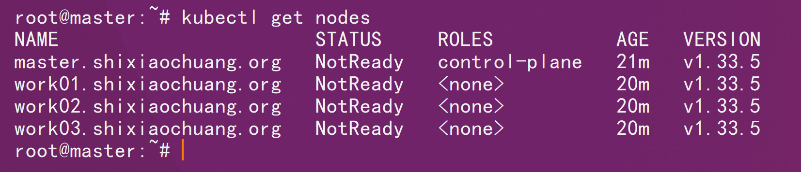
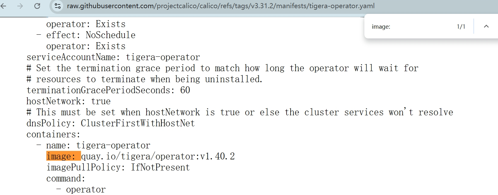
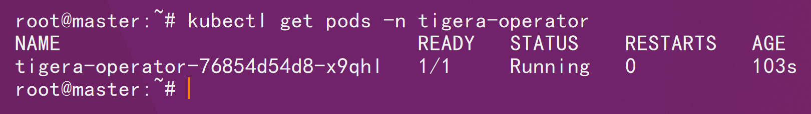
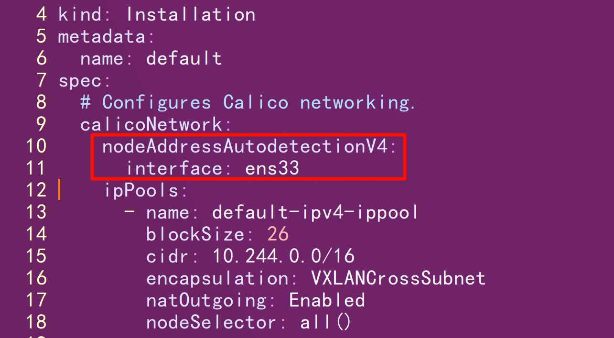
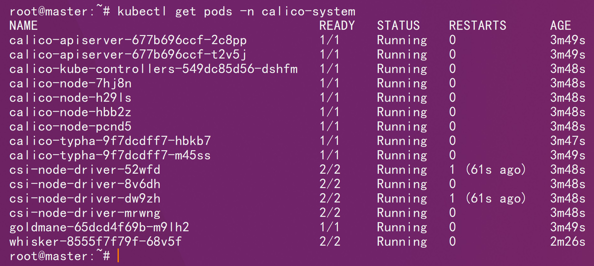

# 一、基础环境



# 二、镜像修改

````http
https://raw.githubusercontent.com/projectcalico/calico/refs/tags/v3.31.2/manifests/tigera-operator.yaml
````



```sh
docker pull quay.io/tigera/operator:v1.40.2
```

```sh
docker tag quay.io/tigera/operator:v1.40.2 shixiaochuangk8s/tigera-operator:v1.40.2
```

```sh
docker push shixiaochuangk8s/tigera-operator:v1.40.2
```

# 三、实战部署

```sh
kubectl create -f operator-crds.yaml
```

```sh
kubectl create -f tigera-operator.yaml
```

```sh
kubectl get pods -n tigera-operator
```



随后我们修改`custom-resources.yaml`里面的pod ip段信息和划分子网的大小。

**Calico 选错网卡会直接导致节点 NotReady / Pod 无法通信**。

在这个 **Installation CR（custom-resources.yaml）** 里，需要加的是：

```yaml
spec:
  calicoNetwork:
    nodeAddressAutodetectionV4:
      ...
```

方式一：按网卡名（最常用）

指定网卡名称（比如 `eth0`、`ens33`）

```yaml
spec:
  calicoNetwork:
    nodeAddressAutodetectionV4:
      interface: eth0
```

多网卡可以用正则：

```yaml
interface: "eth.*"
```

方式二：排除网卡

很多云环境 / 虚拟机场景常用

```yaml
spec:
  calicoNetwork:
    nodeAddressAutodetectionV4:
      skipInterface: "lo,docker0"
```

方式三：按 IP 段选择

```yaml
spec:
  calicoNetwork:
    nodeAddressAutodetectionV4:
      cidrs:
        - 192.168.0.0/16
```



```shell
kubectl apply -f custom-resources.yaml
```

```sh
kubectl get pods -n calico-system
```

