# 一、基础环境

ceph集群：

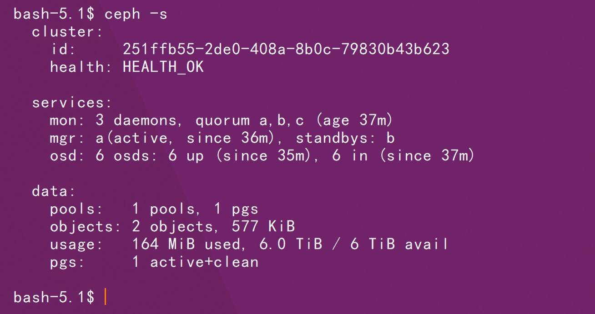

消费集群：

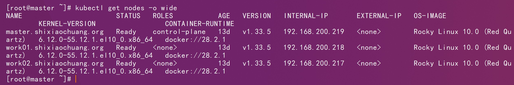

# 二、镜像修改

```http
https://raw.githubusercontent.com/ceph/ceph-csi/refs/tags/v3.15.1/deploy/rbd/kubernetes/csi-rbdplugin-provisioner.yaml
```

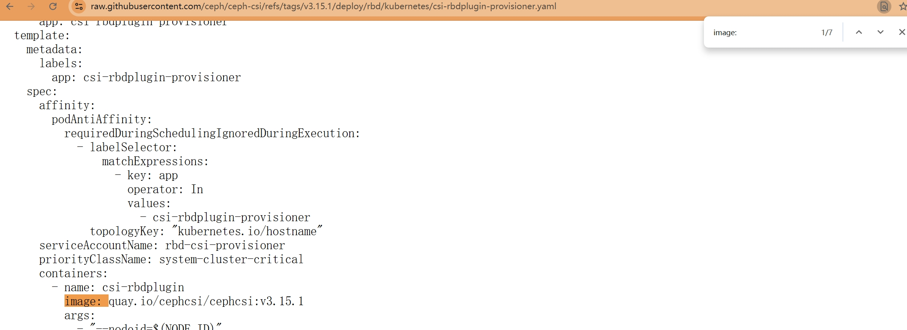

```sh
docker pull quay.io/cephcsi/cephcsi:v3.15.1
```

```sh
docker tag quay.io/cephcsi/cephcsi:v3.15.1 shixiaochuangk8s/cephcsi-cephcsi:v3.15.1
```

```sh
docker push shixiaochuangk8s/cephcsi-cephcsi:v3.15.1
```

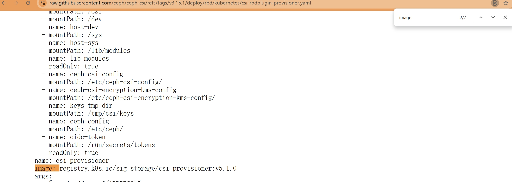

```sh
docker pull registry.k8s.io/sig-storage/csi-provisioner:v5.1.0
```

```sh
docker tag registry.k8s.io/sig-storage/csi-provisioner:v5.1.0 shixiaochuangk8s/sig-storage-csi-provisioner:v5.1.0
```

```sh
docker push shixiaochuangk8s/sig-storage-csi-provisioner:v5.1.0
```

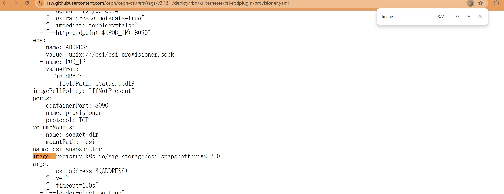

```sh
docker pull registry.k8s.io/sig-storage/csi-snapshotter:v8.2.0
```

```sh
docker tag registry.k8s.io/sig-storage/csi-snapshotter:v8.2.0 shixiaochuangk8s/sig-storage-csi-snapshotter:v8.2.0
```

```sh
docker push shixiaochuangk8s/sig-storage-csi-snapshotter:v8.2.0
```

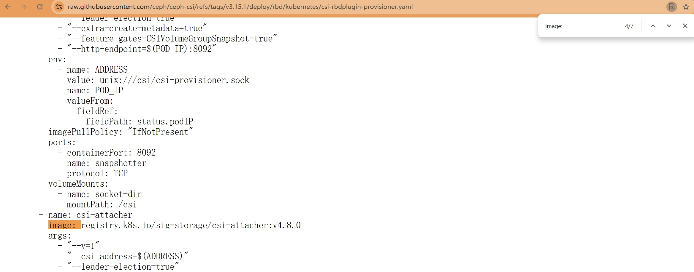

```sh
docker pull registry.k8s.io/sig-storage/csi-attacher:v4.8.0
```

```sh
docker tag registry.k8s.io/sig-storage/csi-attacher:v4.8.0 shixiaochuangk8s/sig-storage-csi-attacher:v4.8.0
```

```sh
docker push shixiaochuangk8s/sig-storage-csi-attacher:v4.8.0
```

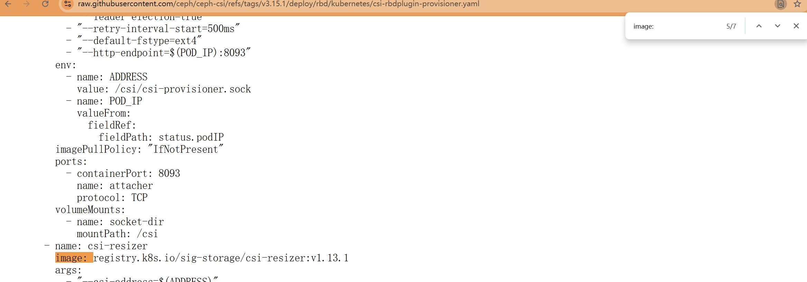

```sh
docker pull registry.k8s.io/sig-storage/csi-resizer:v1.13.1
```

```sh
docker tag  registry.k8s.io/sig-storage/csi-resizer:v1.13.1 shixiaochuangk8s/sig-storage-csi-resizer:v1.13.1
```

```sh
docker push shixiaochuangk8s/sig-storage-csi-resizer:v1.13.1
```

```http
https://raw.githubusercontent.com/ceph/ceph-csi/refs/tags/v3.15.1/deploy/rbd/kubernetes/csi-rbdplugin.yaml
```

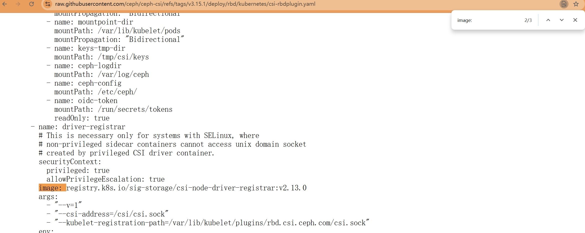

```sh
docker pull registry.k8s.io/sig-storage/csi-node-driver-registrar:v2.13.0
```

```sh
docker tag registry.k8s.io/sig-storage/csi-node-driver-registrar:v2.13.0 shixiaochuangk8s/sig-storage-csi-node-driver-registrar:v2.13.0
```

```sh
docker push shixiaochuangk8s/sig-storage-csi-node-driver-registrar:v2.13.0
```

# 三、部署

```sh
kubectl create namespace ceph-csi-rbd
```

```sh
kubectl apply -f csidriver.yaml
```

```sh
kubectl apply -f csi-provisioner-rbac.yaml
```

```sh
kubectl apply -f csi-nodeplugin-rbac.yaml
```

```sh
kubectl apply -f csi-config-map.yaml
```

```sh
kubectl apply -f ceph-conf.yaml
```

```sh
kubectl apply -f csi-rbdplugin-provisioner.yaml
```

```sh
kubectl get pods -l app=csi-rbdplugin-provisioner -n ceph-csi-rbd
```

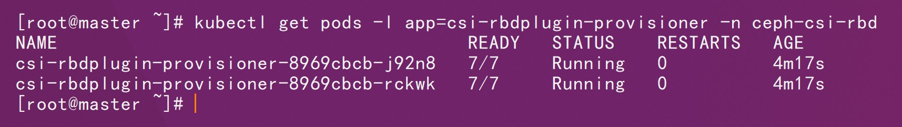

```sh
kubectl apply -f csi-rbdplugin.yaml
```

```sh
kubectl get pods -l app=csi-rbdplugin -n ceph-csi-rbd
```

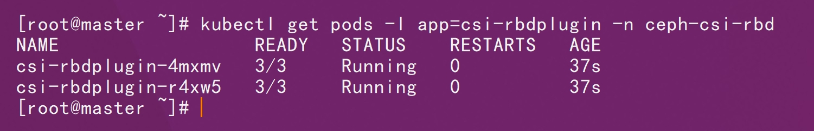

```sh
kubectl get all -n ceph-csi-rbd
```

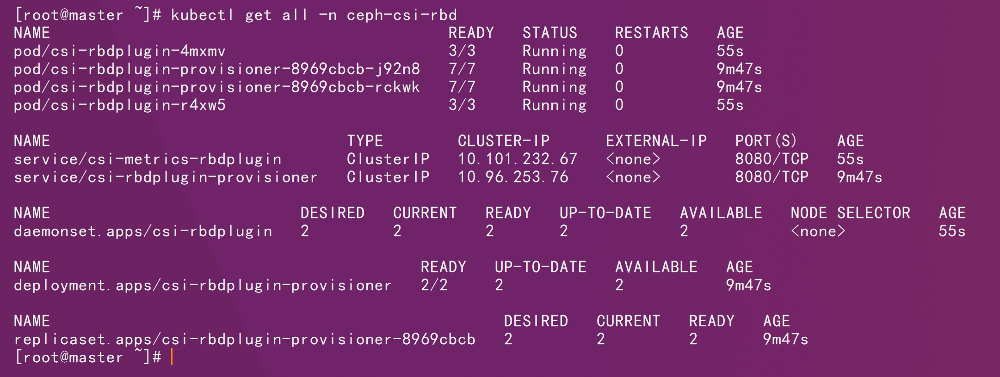

# 四、测试

```sh
# 创建存储池
ceph osd pool create kube-rbddata 16 16
```

```sh
# 启用rbd功能
ceph osd pool application enable kube-rbddata rbd
```

```sh
ceph osd pool application get kube-rbddata
```

```sh
# 存储池初始化
rbd pool init -p kube-rbddata
```

```sh
ceph osd pool stats kube-rbddata
```

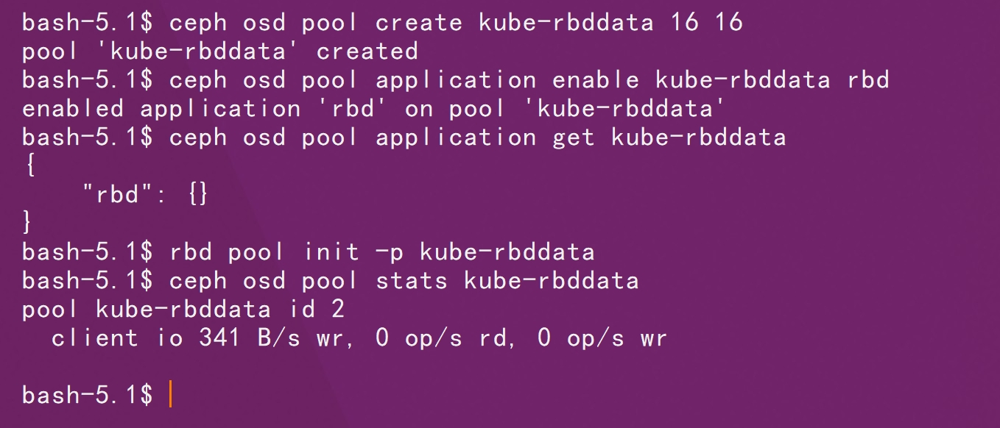

```sh
# 创建专属的账号信息
ceph auth get-or-create client.k8s \
  mon 'allow r' \
  osd 'allow rwx pool=kube-rbddata'
```

```sh
# 查看用户信息确认
ceph auth get client.k8s
```

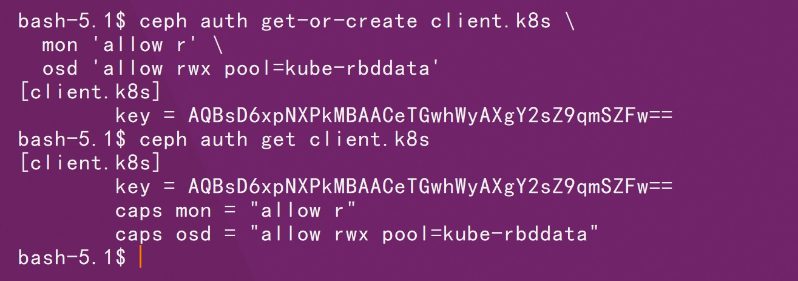

```sh
kubectl  apply -f csi-rbd-secret.yaml
```

```sh
kubectl  apply -f csi-rbd-sc.yaml
```

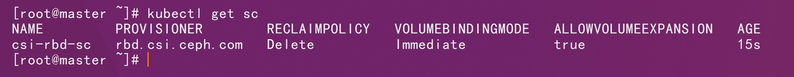

```sh
kubectl apply -f rbd-pvc.yaml
```

```sh
kubectl get pvc
```

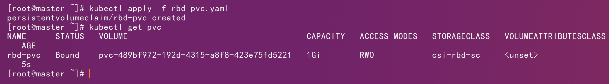
