# 一、基础环境

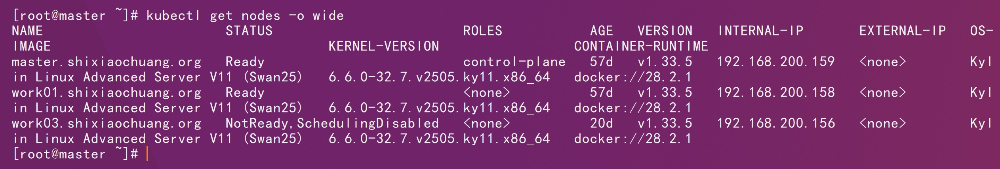

# 二、官方仓库

```http
https://github.com/kubernetes-csi/csi-driver-nfs/tree/v4.12.1/deploy
```

```http
https://github.com/kubernetes-csi/csi-driver-nfs/blob/v4.12.1/deploy/rbac-csi-nfs.yaml
```

```http
https://github.com/kubernetes-csi/csi-driver-nfs/blob/v4.12.1/deploy/csi-nfs-driverinfo.yaml
```

```http
https://github.com/kubernetes-csi/csi-driver-nfs/blob/v4.12.1/deploy/csi-nfs-controller.yaml
```

```http
https://github.com/kubernetes-csi/csi-driver-nfs/blob/v4.12.1/deploy/csi-nfs-node.yaml
```

```http
https://github.com/kubernetes-csi/csi-driver-nfs/blob/v4.12.1/deploy/storageclass.yaml
```

```http
https://github.com/kubernetes-csi/csi-driver-nfs/blob/v4.12.1/deploy/example/pvc-nfs-csi-dynamic.yaml
```

# 四、镜像修改

```http
https://raw.githubusercontent.com/kubernetes-csi/csi-driver-nfs/refs/tags/v4.12.1/deploy/csi-nfs-controller.yaml
```

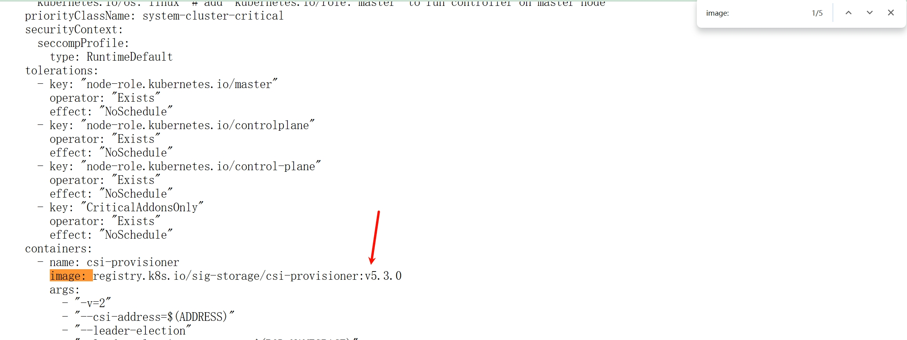

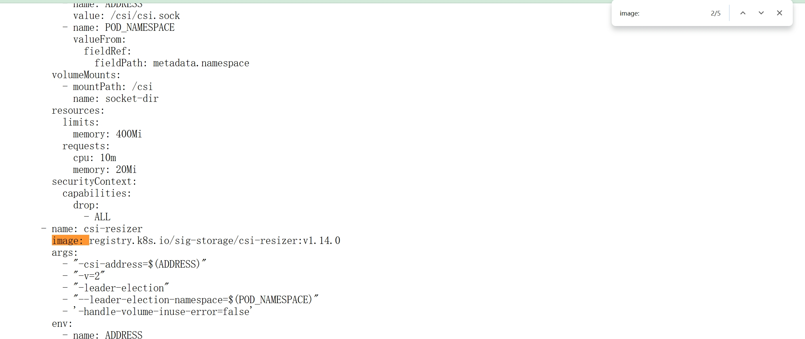

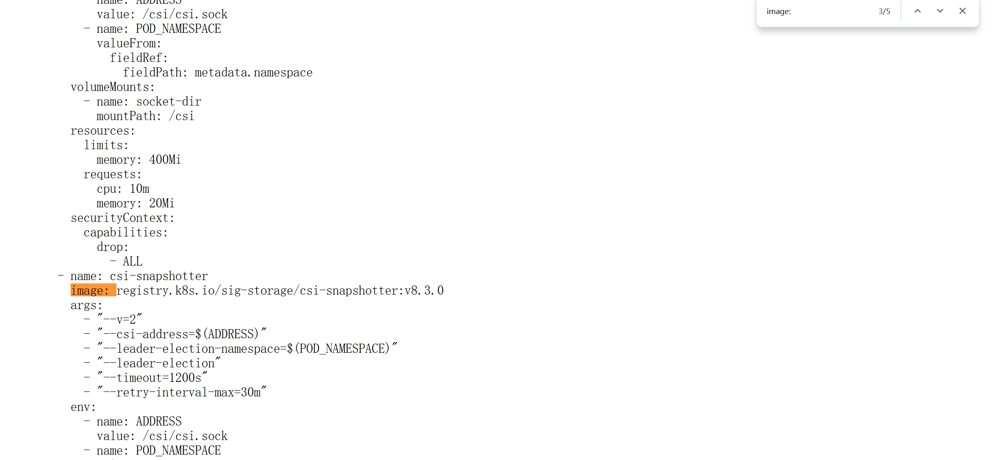

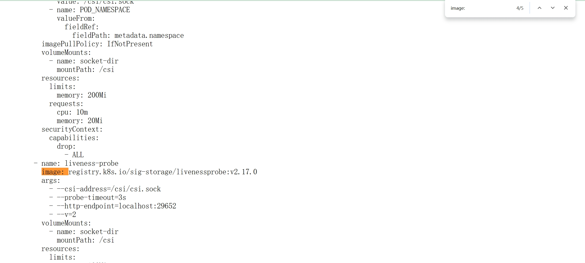

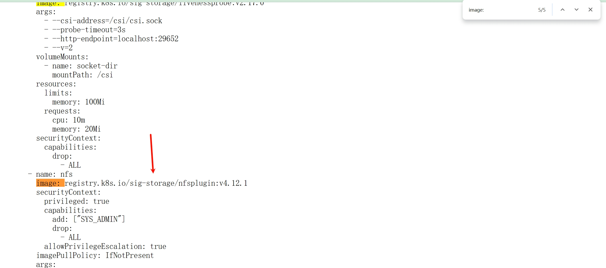

```sh
docker pull registry.k8s.io/sig-storage/csi-provisioner:v5.3.0
```

```sh
docker tag registry.k8s.io/sig-storage/csi-provisioner:v5.3.0 shixiaochuangk8s/sig-storage-csi-provisioner:v5.3.0
```

```sh
docker push shixiaochuangk8s/sig-storage-csi-provisioner:v5.3.0
```

```sh
docker pull registry.k8s.io/sig-storage/csi-resizer:v1.14.0
```

```sh
docker tag registry.k8s.io/sig-storage/csi-resizer:v1.14.0 shixiaochuangk8s/sig-storage-csi-resizer:v1.14.0
```

```sh
docker push shixiaochuangk8s/sig-storage-csi-resizer:v1.14.0
```

```sh
docker pull registry.k8s.io/sig-storage/csi-snapshotter:v8.3.0
```

```sh
docker tag registry.k8s.io/sig-storage/csi-snapshotter:v8.3.0 shixiaochuangk8s/sig-storage-csi-snapshotter:v8.3.0 
```

```sh
docker push shixiaochuangk8s/sig-storage-csi-snapshotter:v8.3.0 
```

```sh
docker pull registry.k8s.io/sig-storage/livenessprobe:v2.17.0
```

```sh
docker tag registry.k8s.io/sig-storage/livenessprobe:v2.17.0 shixiaochuangk8s/sig-storage-livenessprobe:v2.17.0
```

```sh
docker push shixiaochuangk8s/sig-storage-livenessprobe:v2.17.0 
```

```sh
docker pull registry.k8s.io/sig-storage/nfsplugin:v4.12.1
```

```sh
docker tag registry.k8s.io/sig-storage/nfsplugin:v4.12.1 shixiaochuangk8s/sig-storage-nfsplugin:v4.12.1
```

```sh
docker push shixiaochuangk8s/sig-storage-nfsplugin:v4.12.1
```

```http
https://raw.githubusercontent.com/kubernetes-csi/csi-driver-nfs/refs/tags/v4.12.1/deploy/csi-nfs-node.yaml
```

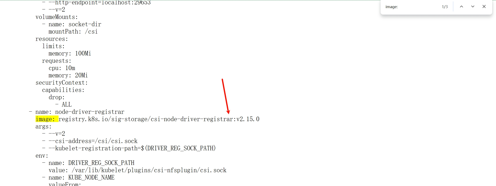

```sh
docker pull registry.k8s.io/sig-storage/csi-node-driver-registrar:v2.15.0
```

```sh
docker tag registry.k8s.io/sig-storage/csi-node-driver-registrar:v2.15.0 shixiaochuangk8s/sig-storage-csi-node-driver-registrar:v2.15.0
```

```sh
docker push shixiaochuangk8s/sig-storage-csi-node-driver-registrar:v2.15.0
```

# 三、部署

```sh
kubectl apply -f rbac-csi-nfs.yaml
```

```sh
kubectl apply -f csi-nfs-driverinfo.yaml
```

```sh
kubectl apply -f csi-nfs-controller.yaml
```

```sh
kubectl -n kube-system get pod -o wide -l app=csi-nfs-controller
```

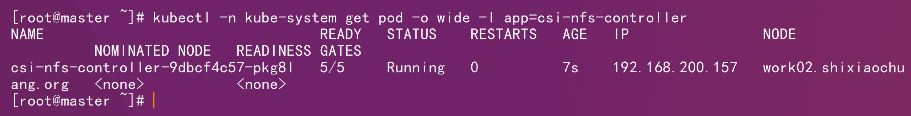

```sh
kubectl apply -f csi-nfs-node.yaml
```

```sh
kubectl -n kube-system get pod -o wide -l app=csi-nfs-node
```

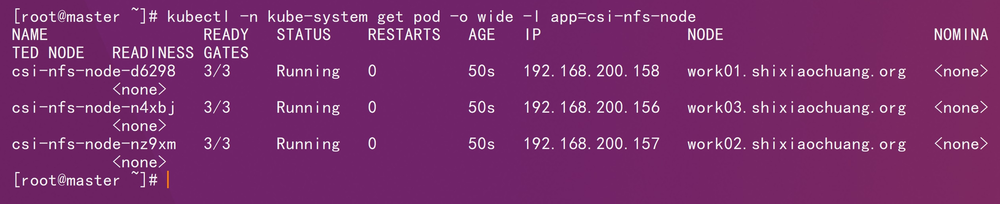

准备nfs的服务器

```sh
dnf install rpcbind -y
```

```sh
systemctl enable --now rpcbind
```

```sh
systemctl status rpcbind
```

```sh
dnf install nfs-utils -y
```

```sh
systemctl enable --now nfs-server
```

```sh
systemctl status  nfs-server
```

```sh
cat /proc/fs/nfsd/versions
```


```sh
# 准备一个共享目录
mkdir /opt/data/csi-nfs -pv
```

```sh
# 将共享目录以读写权限暴露给192.168.200.0/24网段中的所有主机
vim /etc/exports
```

```ini
/opt/data/csi-nfs     192.168.200.0/24(rw,no_root_squash)
```

```sh
systemctl restart nfs-server
```

```sh
# 查看当前的共享目录设置
exportfs
```

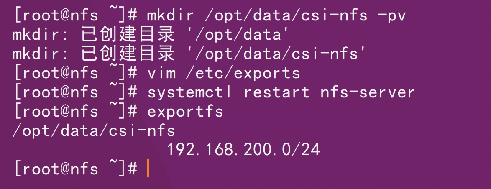

要在的每个node节点上都安装下nfs，这样的目的是为了node节点可以驱动nfs设备

```sh
dnf install rpcbind -y
```

```sh
dnf install nfs-utils -y
```

```sh
systemctl enable --now rpcbind
```

```sh
kubectl apply -f storageclass.yaml
```

```sh
kubectl get sc
```


测试：

```sh
kubectl apply -f pvc-nfs-csi-dynamic.yaml
```

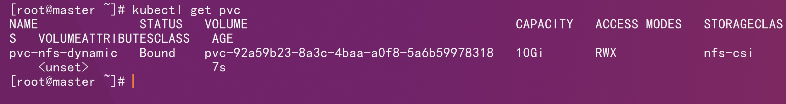