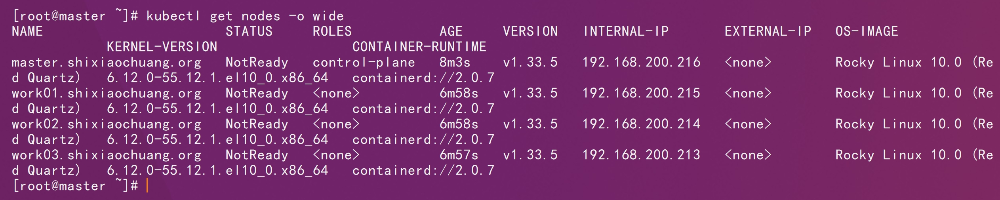
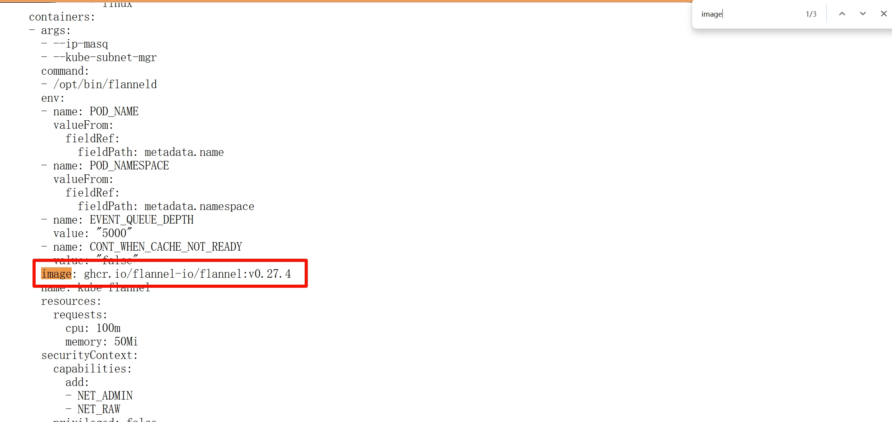
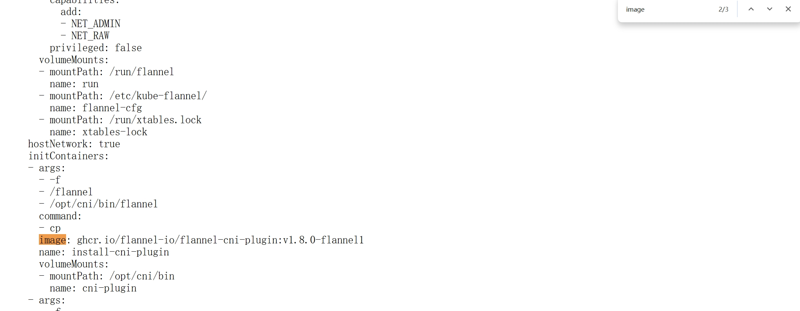
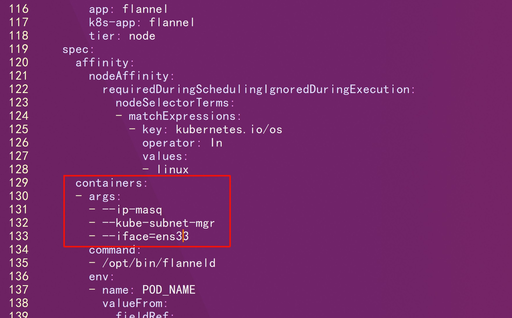
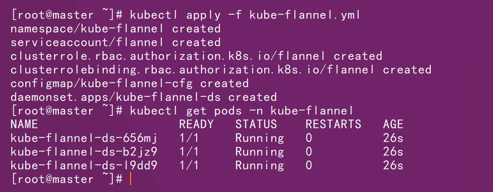
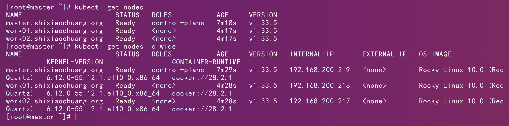

# 一、基础环境说明



# 二、镜像修改

```http
https://github.com/flannel-io/flannel/releases/tag/v0.27.4
```



```sh
docker pull ghcr.io/flannel-io/flannel:v0.27.4
```

```sh
docker tag ghcr.io/flannel-io/flannel:v0.27.4 shixiaochuangk8s/flannel-io-flannel:v0.27.4
```

```sh
docker push shixiaochuangk8s/flannel-io-flannel:v0.27.4
```



```sh
docker pull ghcr.io/flannel-io/flannel-cni-plugin:v1.8.0-flannel1
```

```sh
docker tag  ghcr.io/flannel-io/flannel-cni-plugin:v1.8.0-flannel1  shixiaochuangk8s/flannel-io-flannel-cni-plugin:v1.8.0-flannel1 
```

```sh
docker push shixiaochuangk8s/flannel-io-flannel-cni-plugin:v1.8.0-flannel1 
```

# 三、部署

如果有节点是多网卡，则需要在资源清单文件中指定内网网卡

搜索到名 kube-flannel-ds 的 DaemonSet，在kube-flannel容器下面



```yaml
containers:
- name: kube-flannel
  image: quay.io/coreos/flannel:v0.15.0
  command:
  - /opt/bin/flanneld
  args:
  - --ip-masq
  - --kube-subnet-mgr
  - --iface=ens33  # 如果是多网卡的话，指定内网网卡的名称
......
```

```sh
kubectl apply -f kube-flannel.yml
```

```sh
kubectl get pods -n kube-flannel
```



```sh
kubectl get nodes
```



