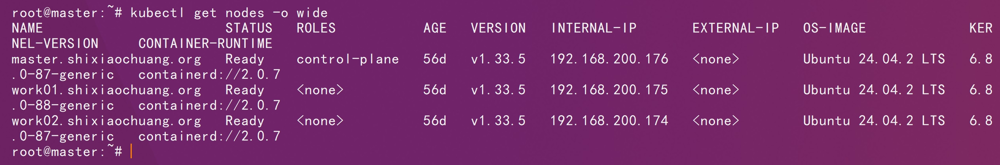
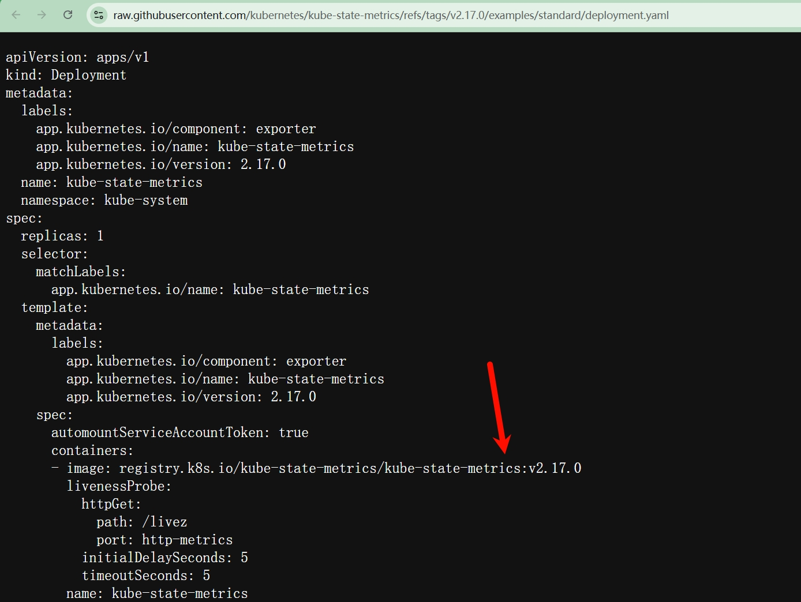

# 一、基础环境



# 二、官方仓库

```http
https://github.com/kubernetes/kube-state-metrics/blob/v2.17.0/examples/standard/service.yaml
```

```http
https://raw.githubusercontent.com/kubernetes/kube-state-metrics/refs/tags/v2.17.0/examples/standard/cluster-role.yaml
```

```http
https://raw.githubusercontent.com/kubernetes/kube-state-metrics/refs/tags/v2.17.0/examples/standard/service-account.yaml
```

```http
https://raw.githubusercontent.com/kubernetes/kube-state-metrics/refs/tags/v2.17.0/examples/standard/cluster-role-binding.yaml
```

```http
https://raw.githubusercontent.com/kubernetes/kube-state-metrics/refs/tags/v2.17.0/examples/standard/deployment.yaml
```

```http
https://raw.githubusercontent.com/kubernetes/kube-state-metrics/refs/tags/v2.17.0/examples/standard/service.yaml
```

# 三、镜像修改



```sh
docker pull registry.k8s.io/kube-state-metrics/kube-state-metrics:v2.17.0
```

```sh
docker tag registry.k8s.io/kube-state-metrics/kube-state-metrics:v2.17.0 shixiaochuangk8s/kube-state-metrics:v2.17.0
```

```sh
docker push shixiaochuangk8s/kube-state-metrics:v2.17.0
```

# 四、部署

```sh
kubectl create namespace ksm-ns
```

```sh
kubectl apply -f cluster-role.yaml
```

```sh
kubectl apply -f service-account.yaml
```

```sh
kubectl apply -f cluster-role-binding.yaml
```

```sh
kubectl apply -f deployment.yaml
```

```sh
kubectl get pods -n ksm-ns
```


```sh
kubectl apply -f service.yaml
```

