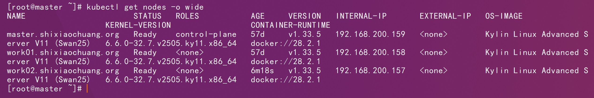
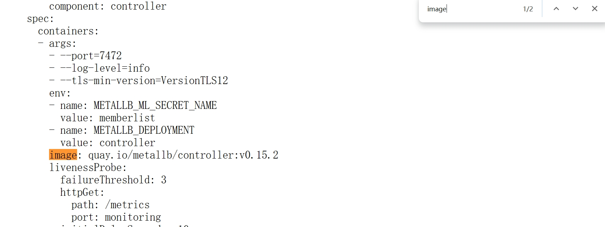
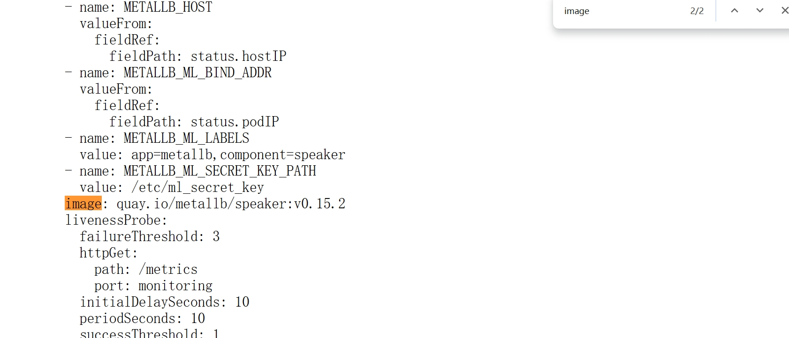
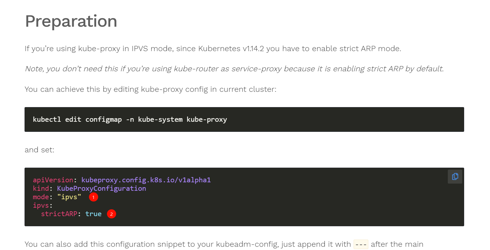
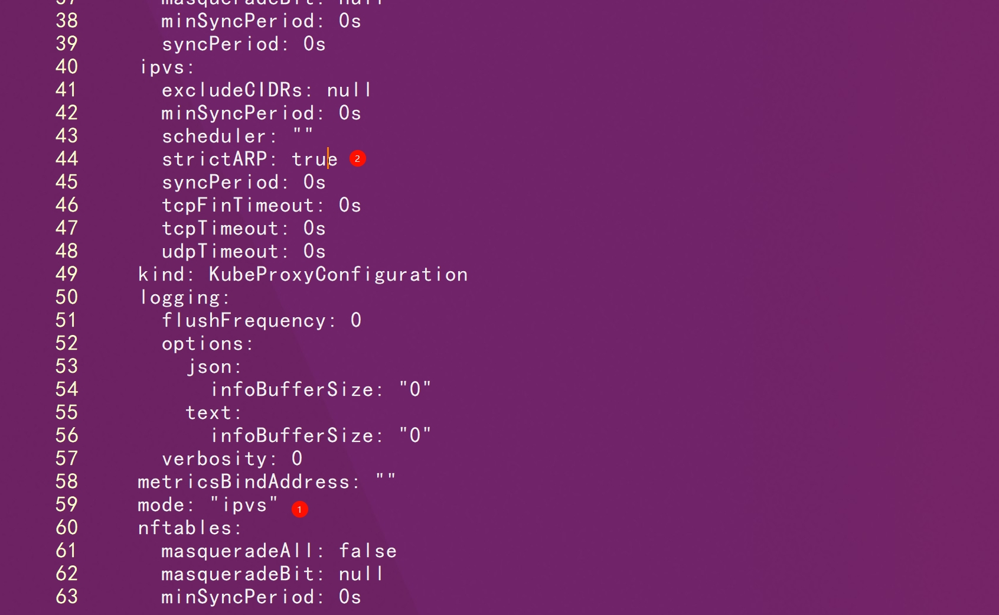
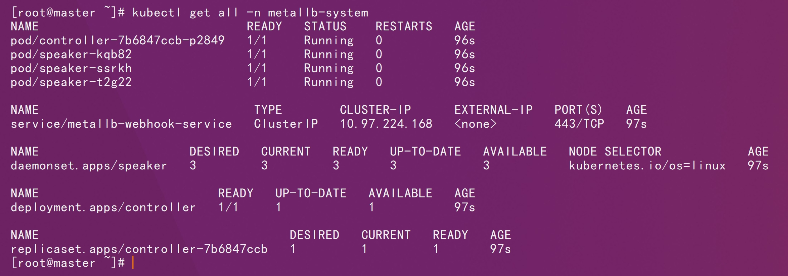
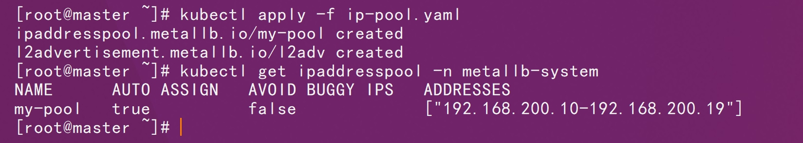

# 一、基础环境



# 二、官方仓库

```http
https://raw.githubusercontent.com/metallb/metallb/v0.15.2/config/manifests/metallb-native.yaml
```

# 三、镜像修改






```sh
docker pull quay.io/metallb/controller:v0.15.2
```

```sh
docker pull quay.io/metallb/speaker:v0.15.2
```

```sh
docker tag quay.io/metallb/speaker:v0.15.2 shixiaochuangk8s/metallb-speaker:v0.15.2
```

```sh
docker tag quay.io/metallb/controller:v0.15.2 shixiaochuangk8s/metallb-controller:v0.15.2
```

```sh
docker push shixiaochuangk8s/metallb-speaker:v0.15.2
```

```sh
docker push shixiaochuangk8s/metallb-controller:v0.15.2
```

# 四、部署

```http
https://metallb.universe.tf/installation/
```



```sh
kubectl edit configmap -n kube-system kube-proxy
```



```sh
kubectl apply -f metallb-native.yaml
```

```sh
kubectl get all -n metallb-system
```



```sh
kubectl apply -f ip-pool.yaml
```

```sh
kubectl get ipaddresspool -n metallb-system
```




