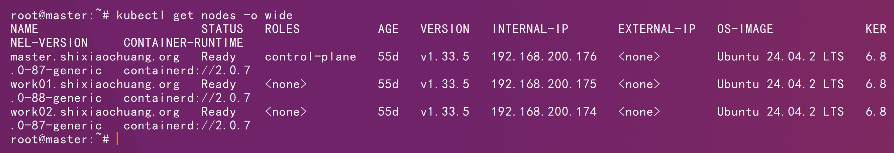
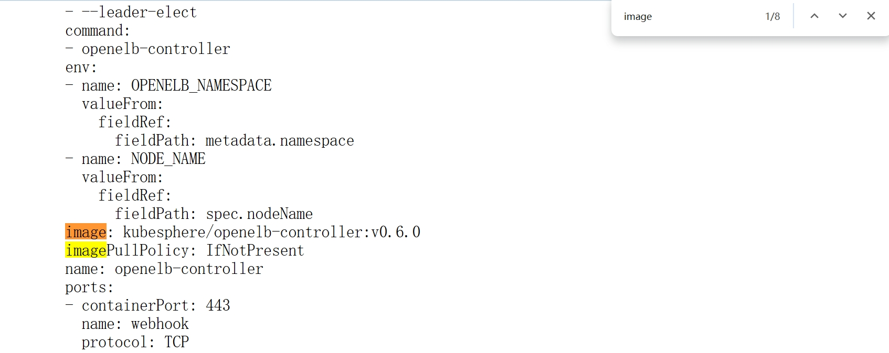
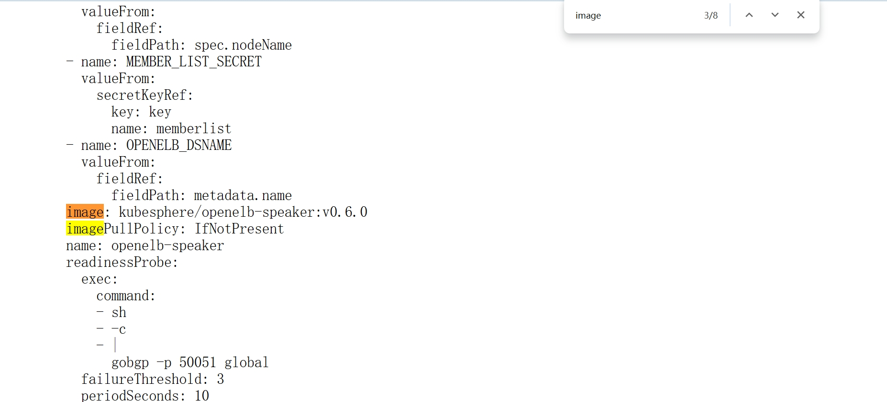
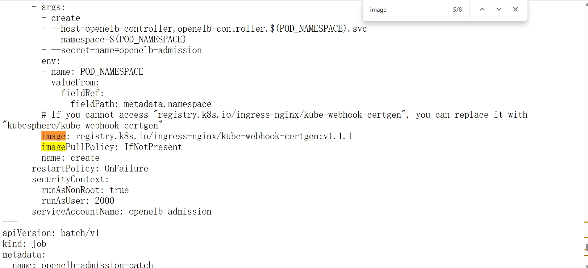
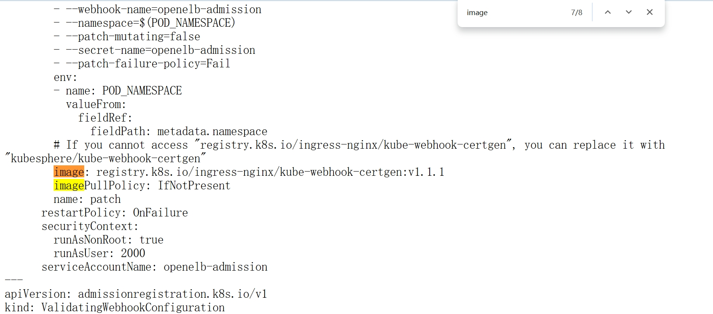
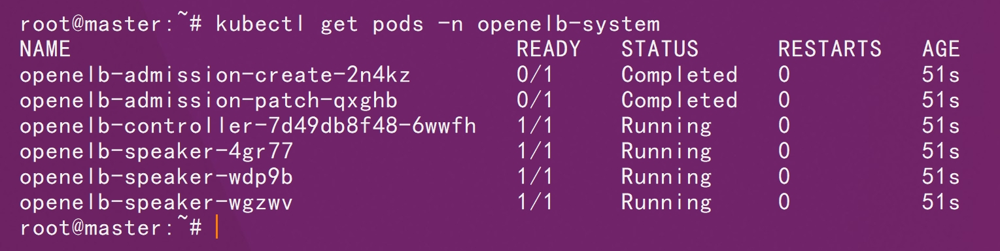
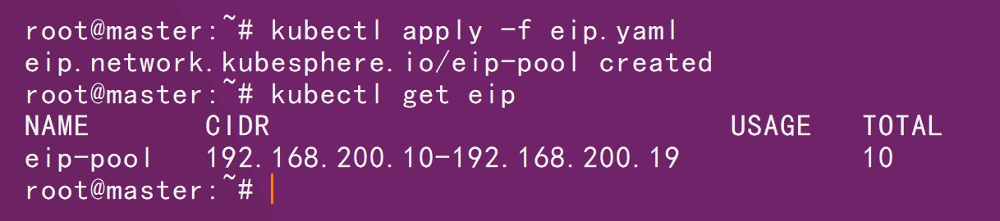

# 一、基础环境



# 二、官方仓库

```http
https://raw.githubusercontent.com/openelb/openelb/refs/tags/v0.6.0/deploy/openelb.yaml
```

# 三、镜像修改









```sh
docker pull kubesphere/openelb-controller:v0.6.0
```

```sh
docker pull kubesphere/openelb-speaker:v0.6.0
```

```sh
docker pull registry.k8s.io/ingress-nginx/kube-webhook-certgen:v1.1.1
```

```sh
docker tag kubesphere/openelb-controller:v0.6.0  shixiaochuangk8s/openelb-controller:v0.6.0 
```

```sh
docker tag kubesphere/openelb-speaker:v0.6.0 shixiaochuangk8s/openelb-speaker:v0.6.0 
```

```sh
docker tag registry.k8s.io/ingress-nginx/kube-webhook-certgen:v1.1.1 shixiaochuangk8s/kube-webhook-certgen:v1.1.1
```

```sh
docker push shixiaochuangk8s/openelb-controller:v0.6.0 
```

```sh
docker push shixiaochuangk8s/openelb-speaker:v0.6.0 
```

```sh
docker push shixiaochuangk8s/kube-webhook-certgen:v1.1.1
```

# 四、部署

```sh
kubectl apply -f openelb.yaml
```

```sh
kubectl get pods -n openelb-system
```



```sh
kubectl apply -f eip.yaml
```

