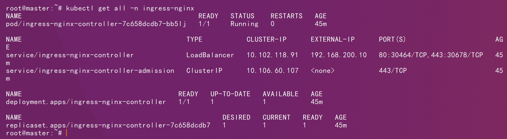

# 一、基础环境说明


# 二、部署

前提：

1、集群中存在动态供给


2、集群中存在ingress nginx controller



```sh
kubectl create namespace prometheus-ns
```

```sh
kubectl apply -f prometheus-pvc.yaml
```

```sh
kubectl apply -f prometheus-rbac.yaml
```

```sh
kubectl apply -f prometheus-cfg.yaml
```

```sh
kubectl apply -f prometheus-deploy.yaml
```

```sh
kubectl apply -f prometheus-svc.yaml
```

```sh
kubectl apply -f prometheus-ingress.yaml
```

```sh
kubectl apply -f prometheus-traefik.yaml
```

```http
http://prometheusui.shixiaochuang.org
```


```sh
kubectl create namespace grafana-ns
```

```sh
kubectl apply -f grafana-pvc.yaml
```

```sh
kubectl apply -f grafana-datasources-cfg.yaml
```

```sh
kubectl apply -f grafana-admin-secret.yaml
```

```sh
kubectl apply -f grafana-deploy.yaml
```

```sh
kubectl apply -f grafana-svc-ingress.yaml
```


