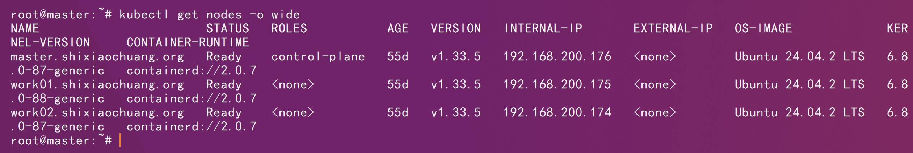
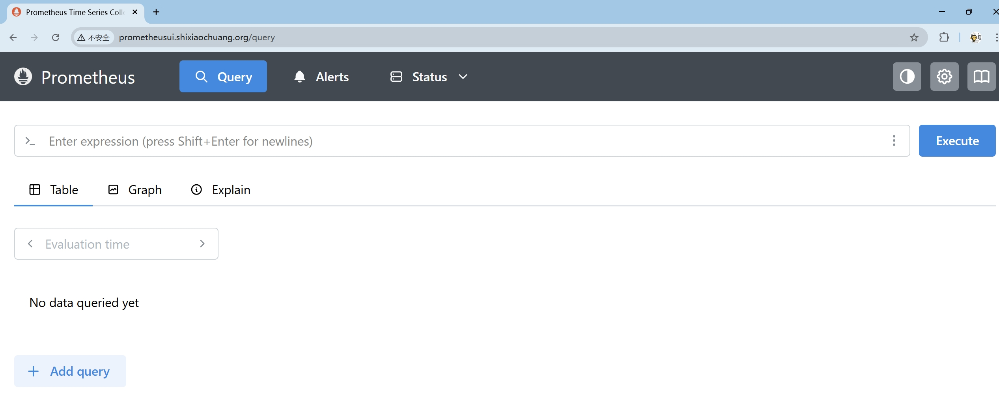
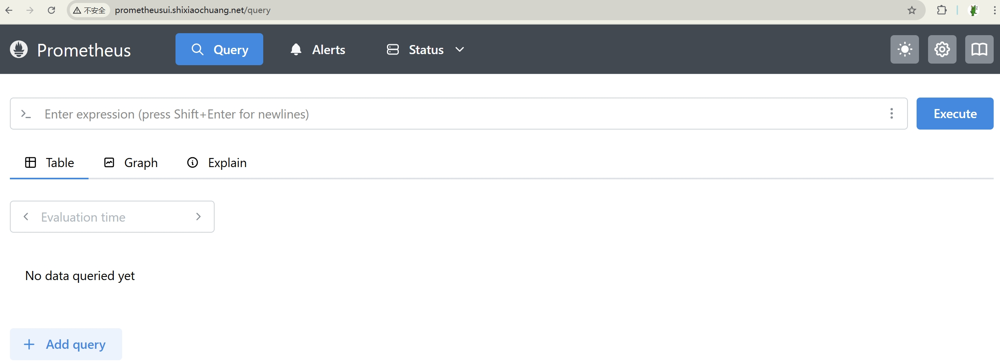
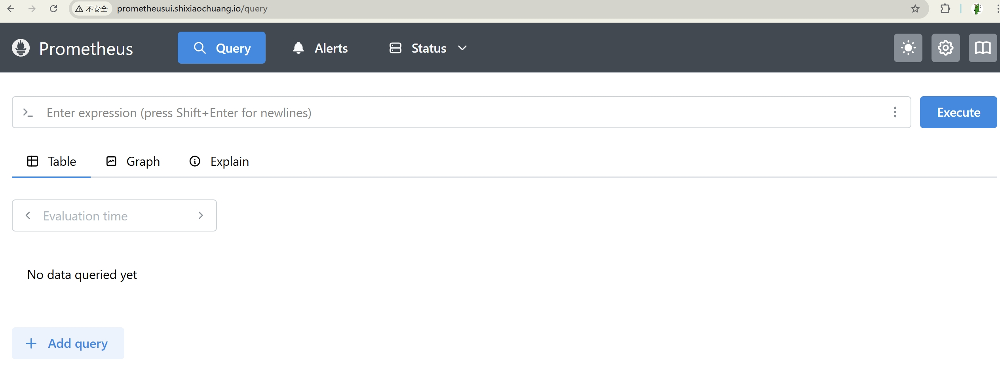

# 一、基础环境说明



# 二、部署

```sh
kubectl create namespace monitor-ns
```

```sh
kubectl apply -f prometheus-pvc.yaml
```

```sh
kubectl apply -f prometheus-rbac.yaml
```

关于配置文件的说明：

```sh
# 默认配置文件
kubectl apply -f prometheus-cfg.yaml
```

```sh
# 包含service的自动发现
kubectl apply -f prometheus-cfg-service.yaml
```

```sh
# 包含kube-state-metrics
kubectl apply -f prometheus-cfg-ksm.yaml
```

```sh
# 包含pods的自动发现
kubectl apply -f prometheus-cfg-pod.yaml
```

```sh
kubectl apply -f prometheus-deploy.yaml
```

```sh
kubectl apply -f prometheus-svc.yaml
```

```sh
kubectl apply -f prometheus-ingress.yaml
```

```http
http://prometheusui.shixiaochuang.org
```



或者：

```sh
kubectl apply -f prometheus-traefik.yaml
```

```http
http://prometheusui.shixiaochuang.net
```



或者：

```sh
kubectl apply -f prometheus-gatewayapi.yaml
```

```http
http://prometheusui.shixiaochuang.io/query
```



```sh
kubectl apply -f grafana-pvc.yaml
```

```sh
kubectl apply -f grafana-datasources-cfg.yaml
```

```sh
kubectl apply -f grafana-admin-secret.yaml
```

```sh
kubectl apply -f grafana-deploy.yaml
```

```shell
kubectl apply -f grafana-svc.yaml
```

```sh
kubectl apply -f grafana-ingress.yaml
```

```http
http://grafana.shixiaochuang.org/login
```


或者：

```sh
kubectl apply -f grafana-traefik.yaml
```

```http
http://grafana.shixiaochuang.net/login
```


或者：

```sh
kubectl apply -f grafana-gatewayapi.yaml
```

```http
http://grafana.shixiaochuang.io/login
```


