# 一、基础环境

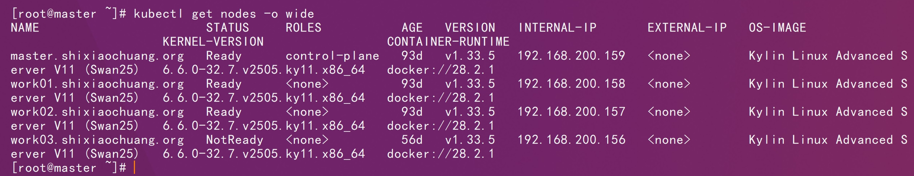

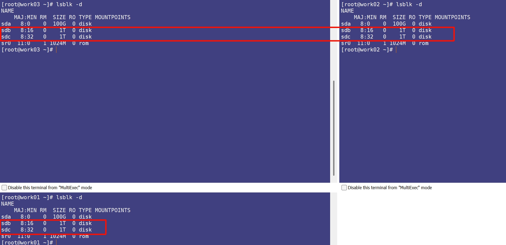

# 二、镜像修改

```http
https://raw.githubusercontent.com/rook/rook/refs/tags/v1.18.8/deploy/examples/csi-operator.yaml
```

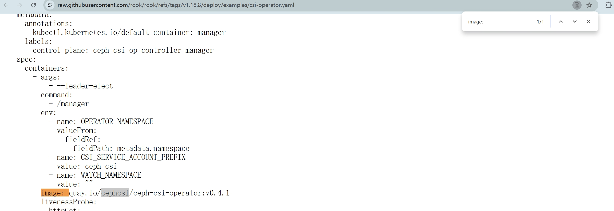

```sh
docker pull quay.io/cephcsi/ceph-csi-operator:v0.4.1
```

```sh
docker tag quay.io/cephcsi/ceph-csi-operator:v0.4.1 shixiaochuangk8s/cephcsi-ceph-csi-operator:v0.4.1
```

```sh
docker push shixiaochuangk8s/cephcsi-ceph-csi-operator:v0.4.1
```

```http
github.com/rook/rook/raw/refs/tags/v1.18.8/deploy/examples/operator.yaml
```

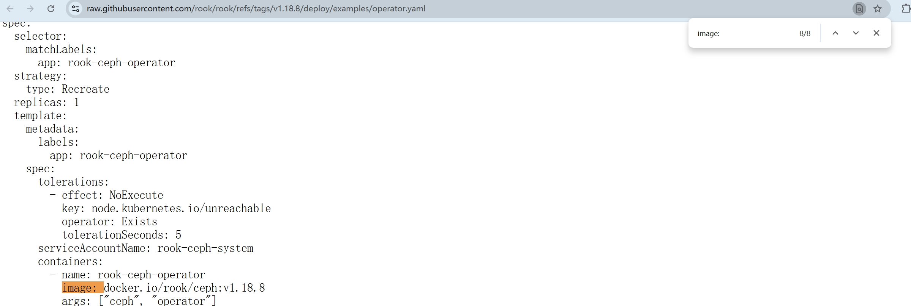

```sh
docker pull docker.io/rook/ceph:v1.18.8
```

```sh
docker tag docker.io/rook/ceph:v1.18.8  shixiaochuangk8s/rook-ceph:v1.18.8
```

```sh
docker pull shixiaochuangk8s/rook-ceph:v1.18.8
```

```http
https://raw.githubusercontent.com/rook/rook/refs/tags/v1.18.8/deploy/examples/cluster.yaml
```

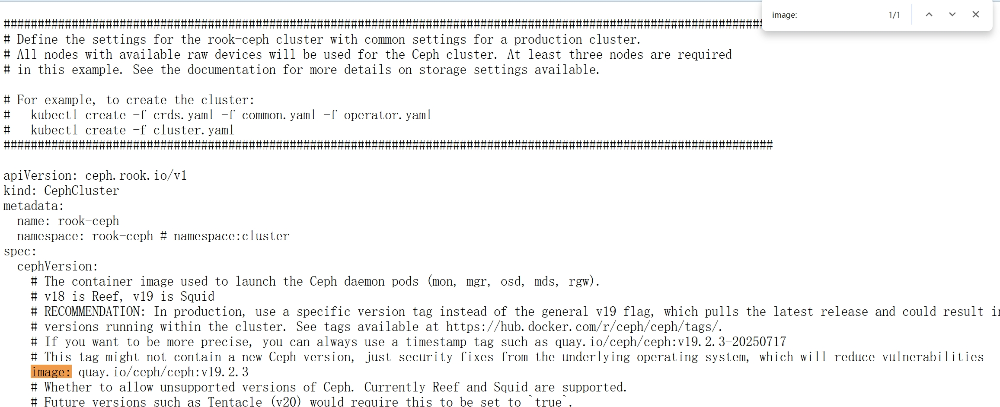

```http
https://raw.githubusercontent.com/rook/rook/refs/tags/v1.18.8/deploy/examples/toolbox.yaml
```

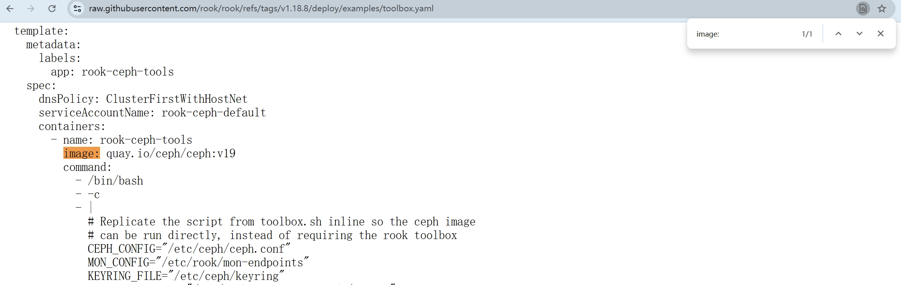

```sh
docker pull quay.io/ceph/ceph:v19.2.3
```

```sh
docker tag quay.io/ceph/ceph:v19.2.3 shixiaochuangk8s/ceph-ceph:v19.2.3
```

```sh
docker push shixiaochuangk8s/ceph-ceph:v19.2.3
```

# 三、部署

```sh
kubectl apply -f crds.yaml
```

```sh
kubectl apply -f common.yaml
```

```sh
kubectl apply -f csi-operator.yaml
```

```sh
kubectl get pods -l control-plane=ceph-csi-op-controller-manager -n rook-ceph
```

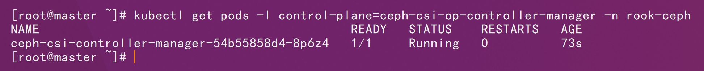

```shell
kubectl apply -f operator.yaml
```

```sh
kubectl get pods -n rook-ceph -l app=rook-ceph-operator
```

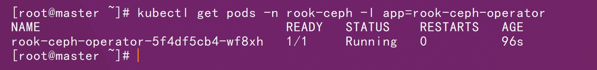

```sh
kubectl apply -f cluster.yaml
```

```sh
kubectl get pods -n rook-ceph
```

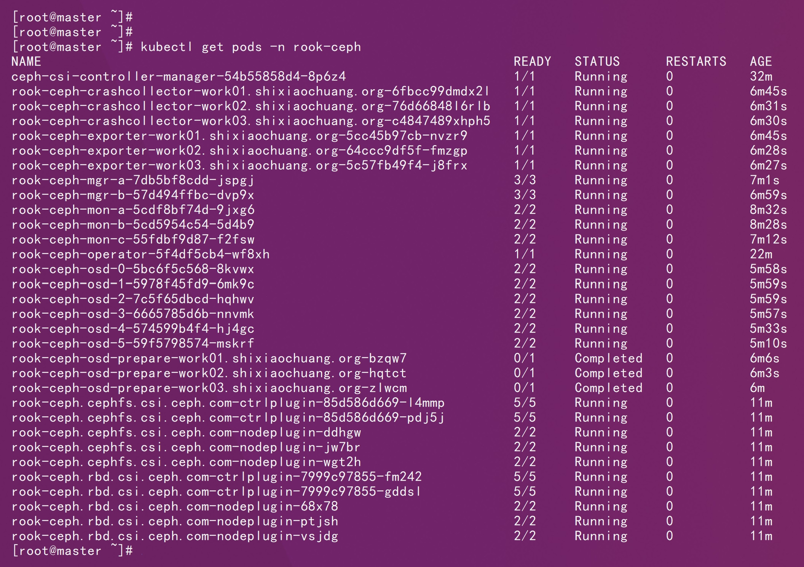

```sh
kubectl apply -f toolbox.yaml
```

```sh
kubectl get pods -n rook-ceph -l app=rook-ceph-tools
```

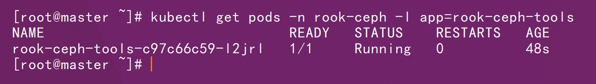

```sh
kubectl -n rook-ceph exec -it deploy/rook-ceph-tools -- bash
```

```sh
ceph status
```

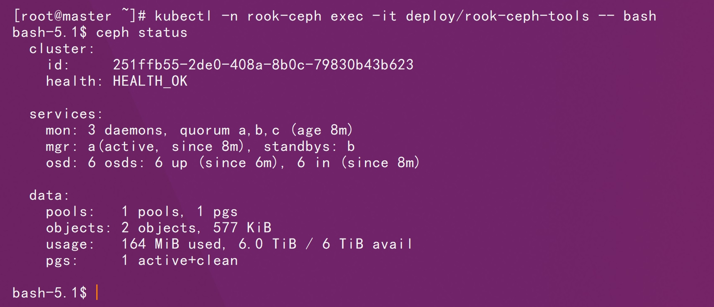

```sh
vim ~/.bashrc
```

在文件末尾追加

```sh
# === Rook Ceph 常用快捷命令 ===
cephsh() {
  kubectl -n rook-ceph exec -it deploy/rook-ceph-tools -- bash
}
```

```sh
source ~/.bashrc
```

```sh
kubectl apply -f rook-ceph-mgr-dashboard.yaml
```

```http
https://192.168.200.157:30443/
```

```sh
kubectl -n rook-ceph get secret rook-ceph-dashboard-password -o jsonpath="{['data']['password']}" | base64 -d
```

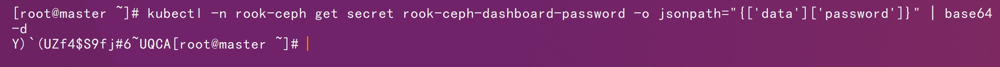

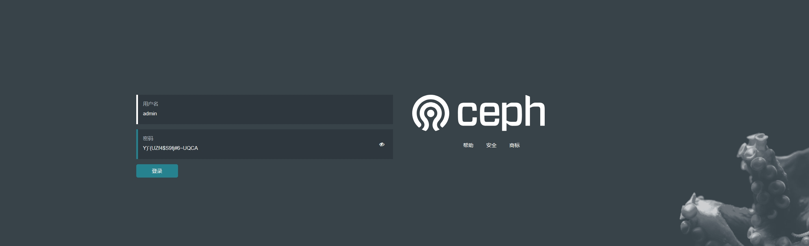

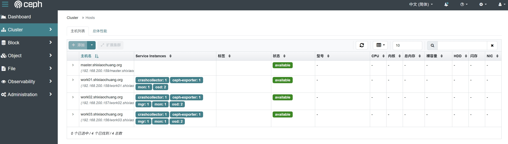

后续如果要用到cephfs需要部署：

```sh
kubectl apply -f filesystem.yaml
```

后续如果要用到object需要部署：

```sh
kubectl apply -f object.yaml
```

```sh
kubectl apply -f object-user.yaml
```

```sh
kubectl get secret rook-ceph-object-user-my-store-my-user \
-n rook-ceph \
-o jsonpath='{.data.AccessKey}' | base64 -d
```

```sh
kubectl get secret rook-ceph-object-user-my-store-my-user \
-n rook-ceph \
-o jsonpath='{.data.SecretKey}' | base64 -d
```

```sh
kubectl apply -f rgw-ingress.yaml
```

后续使用s3客户端测试即可！！
