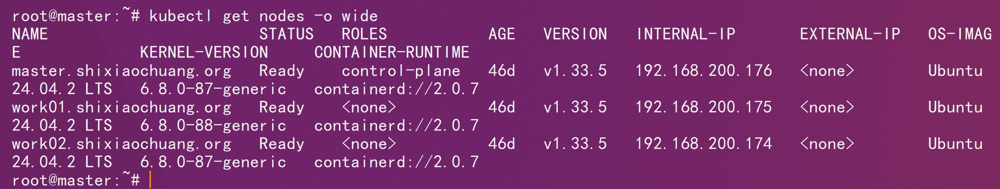
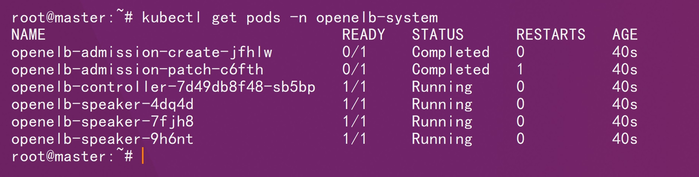
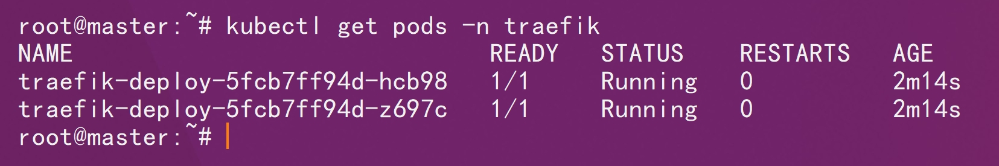
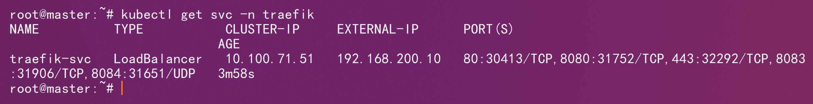
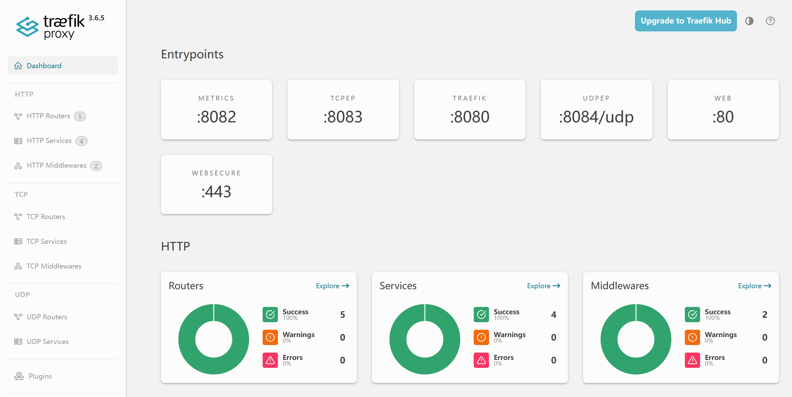

# 一、基础环境说明



# 二、官方仓库

```http
https://github.com/traefik/traefik/blob/v3.6.3/docs/content/reference/dynamic-configuration/kubernetes-crd-definition-v1.yml
```

```http
https://github.com/traefik/traefik/blob/v3.6.3/docs/content/reference/dynamic-configuration/kubernetes-crd-rbac.yml
```

```http
https://raw.githubusercontent.com/openelb/openelb/refs/tags/v0.6.0/deploy/openelb.yaml
```

# 三、部署

```sh
kubectl apply -f kubernetes-crd-definition-v1.yml
```

```sh
kubectl apply -f kubernetes-crd-rbac.yml 
```

```sh
kubectl apply -f traefik-config.yaml
```

```sh
kubectl apply -f openelb.yaml
```

```sh
kubectl get pods -n openelb-system
```



```yaml
kubectl apply -f eip.yaml
```

```sh
kubectl apply -f traefik-deploy.yaml
```

```sh
kubectl get pods -n traefik
```



```sh
kubectl apply -f traefik-service.yaml
```

```sh
kubectl apply -f traefik-dashboard.yaml
```



```http
http://traefikui.shixiaochuang.org/dashboard/
```



